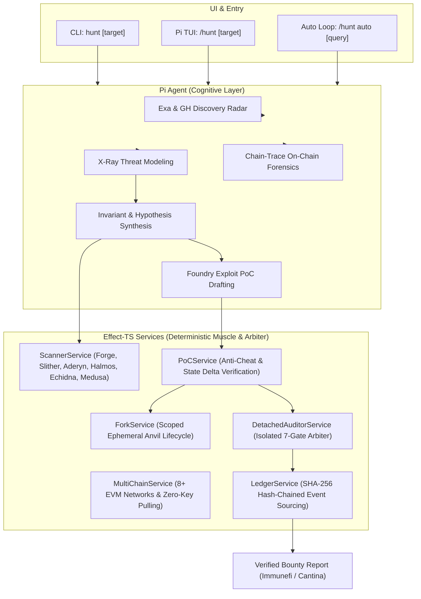

<div align="center">

# 🎯 hunt — Pi Web3 Security Hunter

**Autonomous, Evidence-Backed Web3 & DeFi Vulnerability Hunting Engine**

[](https://opensource.org/licenses/MIT)
[](https://nodejs.org)
[](https://www.typescriptlang.org)
[](https://www.effect.website)
[]()

*KISS Philosophy · Anti-Bamboozle Detached Auditor · Zero-Cheat PoC Synthesizer · Cryptographic Ledger*

</div>

---

## 🌟 Why `hunt`?

In Web3 bug bounty (Immunefi, Cantina, Code4rena, Sherlock), **theoretical alerts and AI hallucinations have zero financial value**. A vulnerability is only real when backed by a deterministic, reproducible, executable **Proof of Concept (PoC)** with measurable state delta on a pinned block.

`hunt` is built from **first principles** with **[Effect-TS](https://www.effect.website/)** to bridge the gap between AI reasoning and deterministic blockchain validation:

1. **Anti-Bamboozle Detached Auditor**:
   - The implementing AI agent is **never trusted** to certify its own claims.
   - An independent, isolated subprocess re-executes the PoC on a clean local Anvil fork to verify all **7 Validation Gates** before any finding can be confirmed.
2. **Strict State Delta & Anti-Cheat PoC Engine**:
   - Findings require an executable Foundry test (`testExploit()`) demonstrating measurable economic gain ($\Delta\text{Balance} > 0$) or privilege takeover.
   - Prohibits `vm.store` cheatcode bypasses: exploits must use realistic transactions.
3. **Autonomous Hunt Loop (`/hunt auto`)**:
   - Exa semantic radar combined with GitHub search to discover newly launched DeFi platforms and pull verified contracts.
   - Continues deep auditing in local sandboxes until a real, confirmed vulnerability is captured and proven.
4. **Zero-Key Verified Contract Pulling**:
   - Automatically pulls multi-file Solidity source trees from Blockscout V2 and Sourcify for 8+ EVM networks without requiring any API keys.
5. **Integrated `chain-trace` On-Chain Forensics**:
   - 18 forensic analysis modules for honeypot detection, rug-pull analysis, DBSCAN holder cluster detection, and token flow tracing.
6. **Full Effect-TS Service Architecture**:
   - Zero-leak resource management via `Scope` and `Effect.acquireRelease` (auto-teardown of Anvil forks and temporary sandboxes).
   - Pure typed errors (`HuntError`), structured concurrency (`Fibers`), and schema validation.
7. **Cryptographic SHA-256 Hash Chain**:
   - Append-only event-sourcing ledger verifying that every command output, finding, and report is cryptographically linked and tamper-proof.

---

## 🏗️ Architecture



---

## ⚡ Quick Start

### 1. Installation

```bash
# Clone repository
git clone https://github.com/ArchdevilForge/pi-web3-hunter.git
cd pi-web3-hunter

# Install dependencies and build
npm install
npm run build

# Link globally for terminal CLI
npm link

# Install into Pi coding agent
pi install $(pwd)
```

### 2. Scanner Prerequisites

`hunt` automatically detects installed security scanners and falls back to standard user paths (`~/.cargo/bin`, `~/.config/.foundry/bin`, `~/.local/bin`, `~/go/bin`, `uv` tool dirs):

| Tool | Category | Installation / Source |
|---|---|---|
| **Foundry** (`forge`, `cast`, `anvil`) | Core EVM Dev & Testing | `curl -L https://foundry.paradigm.xyz | bash && foundryup` |
| **Slither** | Python Static Analysis | `uv tool install slither-analyzer` |
| **Aderyn** | Fast Rust Static Analysis | `cargo install aderyn` |
| **Halmos** | Symbolic Execution Formal Verifier | `uv tool install halmos` |
| **Echidna** | Haskell Invariant Fuzzing | `gh release download -R crytic/echidna` |
| **Medusa** | Go Parallel Invariant Fuzzer | `go install github.com/crytic/medusa@latest` |
| **Docker** | Containerized Scanning | System package manager |

Check scanner health anytime with:
```bash
hunt check
```

---

## 🎯 Usage (KISS Philosophy)

Both in the terminal and in Pi TUI, everything uses the same concise command: **`hunt`**.

### In Pi Interactive TUI (`/hunt`)

Pi TUI includes **interactive autocomplete** (`/hunt ` + Tab / space):

```text
# 1. Autonomous Hunting Loop (Exa Search -> Auto-Audit -> Stop on Confirmed Bug)
/hunt auto
/hunt auto dex
/hunt auto "base launchpad"

# 2. Audit Current Workspace (Default Goal mode)
/hunt .

# 3. Audit a Deployed Smart Contract (Auto-extracts verified source + local Anvil fork)
/hunt 0x1F98431c8aD98523631AE4a59f267346ea31F984 -c 1

# 4. Audit a DApp URL or GitHub Repository
/hunt https://app.uniswap.org
/hunt https://github.com/Uniswap/v3-core

# 5. Status, Reports & Verification
/hunt status        # Display live progress and confirmed findings
/hunt report        # Build and export markdown audit report
/hunt verify        # Verify cryptographic evidence ledger integrity
/hunt check         # Preflight tool availability check
```

### In Terminal CLI (`hunt` or `pwh`)

```bash
# Start a hunt on current directory, URL, or contract
hunt [target] [-c <chain-id>] [-m <goal|list|loop>]

# Subcommands
hunt status <run-id>
hunt report <run-id>
hunt verify <run-id>
hunt check
```

---

## 🛡️ The 7 Validation Gates

Every confirmed vulnerability recorded in the evidence ledger must pass all 7 criteria:

| Gate | Requirement | Proof Mechanism |
|---|---|---|
| `reproduced` | Vulnerability is deterministically reproducible | Foundry PoC test passes (`PASS`) on pinned fork block |
| `impactInScope` | Asset/contract is within program scope | Scope attestation manifest |
| `rootCauseInScope` | Bug originates in audited code (not 3rd-party) | AST & source location mapping |
| `realisticAttacker` | Exploitable without owner/privileged private keys | Transaction sequence uses permissionless caller |
| `notKnownOrIntended` | Not documented, acknowledged, or intended | Protocol docs & specification check |
| `impactDemonstrated` | Concrete asset loss or control compromise | Measured State Delta ($\Delta\text{Balance} > 0$) |
| `pinnedAndRepeatable` | Fully reproducible by third-party triagers | Pinned commit, chain ID, and fork block number |

---

## 🌐 Supported Multi-Chain Networks

Zero-config public RPCs and automated zero-key source code extraction (Blockscout V2 & Sourcify):

| Chain ID | Network | Default Public RPCs | Source Code Extractor |
|:---:|---|---|:---:|
| `1` | Ethereum Mainnet | `https://eth.llamarpc.com`, `https://cloudflare-eth.com` | Blockscout & Sourcify |
| `8453` | Base | `https://mainnet.base.org`, `https://base.llamarpc.com` | Blockscout & Sourcify |
| `42161` | Arbitrum One | `https://arb1.arbitrum.io/rpc`, `https://arbitrum.llamarpc.com` | Blockscout & Sourcify |
| `10` | Optimism | `https://mainnet.optimism.io`, `https://optimism.llamarpc.com` | Blockscout & Sourcify |
| `56` | BNB Smart Chain | `https://bsc-dataseed.binance.org`, `https://bsc.llamarpc.com` | Blockscout & Sourcify |
| `137` | Polygon | `https://polygon-rpc.com`, `https://polygon.llamarpc.com` | Blockscout & Sourcify |
| `43114` | Avalanche C-Chain | `https://api.avax.network/ext/bc/C/rpc` | Snowtrace & Sourcify |
| `59144` | Linea | `https://rpc.linea.build` | Blockscout & Sourcify |
| `534352` | Scroll | `https://rpc.scroll.io` | Blockscout & Sourcify |

---

## 🧪 Development & Testing

```bash
# Run type checking
npm run check

# Run full test suite
npm run test

# Build production bundle
npm run build
```

---

## 📄 License & Acknowledgements

- **License**: This project is licensed under the [MIT License](LICENSE).
- **Acknowledgements**:
  - `chain-trace` on-chain forensics modules integrated from [Xeron2000/chain-trace](https://github.com/Xeron2000/chain-trace).
  - Bundled `fizz`, `solidity-auditor`, `report-writing`, and `x-ray` skill workflows adapted from [Pashov Audit Group Skills](https://github.com/pashov/skills), licensed under MIT © AI Skills Contributors.
